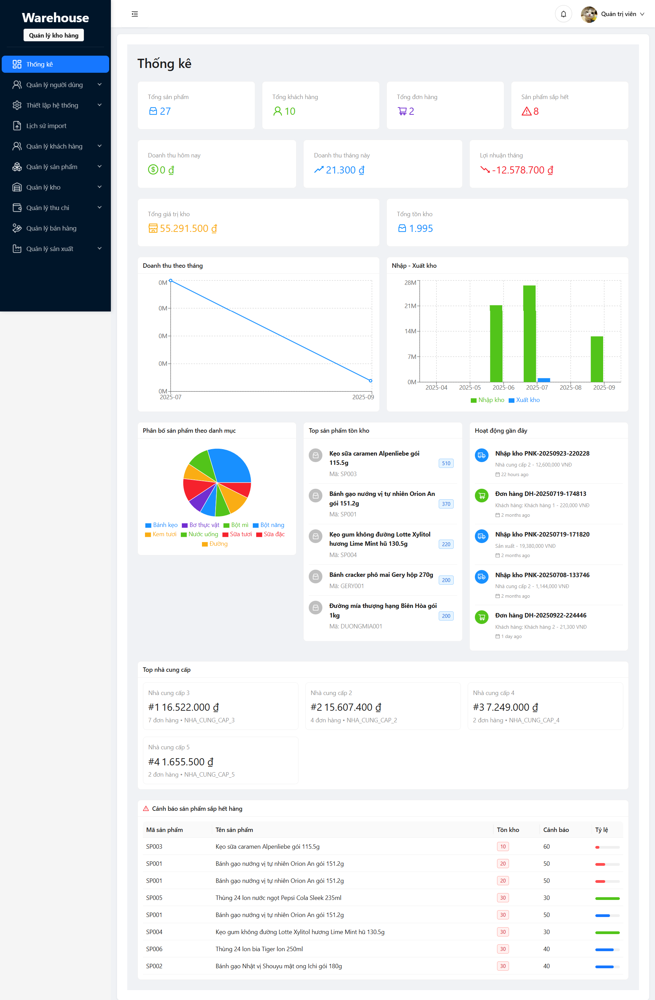

# Hệ thống Quản lý Kho hàng (Warehouse Management System)

## Giới thiệu

Hệ thống Quản lý Kho hàng là một ứng dụng web hiện đại được phát triển để tối ưu hóa quy trình quản lý kho, bán hàng và tài chính cho doanh nghiệp. Hệ thống cung cấp giải pháp toàn diện từ quản lý sản phẩm, nhập xuất kho, đến theo dõi công nợ và báo cáo tài chính.

## Công nghệ sử dụng

### Backend
- **Laravel 11** - PHP Framework mạnh mẽ
- **MySQL 8.0** - Hệ quản trị cơ sở dữ liệu
- **PHP 8.3** - Ngôn ngữ lập trình chính

### Frontend
- **React.js** - Thư viện JavaScript xây dựng giao diện
- **Modern UI/UX Design** - Thiết kế hiện đại, thân thiện người dùng


<p align="center">
  
</p>

### Tính năng bảo mật
- Authentication & Authorization
- Role-based Access Control (RBAC)
- Two-Factor Authentication (2FA)
- Device Management
- Working Hours Control

## Tính năng chính

### 🏢 Quản lý Tổng quan
- **Dashboard**: Thống kê tổng quan, biểu đồ phân tích
- **Cấu hình hệ thống**: Thiết lập các tham số chung
- **Quản lý thời gian làm việc**: Kiểm soát giờ làm việc

### 👥 Quản lý Người dùng & Phân quyền
- **Quản lý người dùng**: CRUD người dùng, phân quyền chi tiết
- **Vai trò**: Admin, Nhân viên, Quản lý kho
- **Bảo mật**: 2FA, quản lý thiết bị đăng nhập

### 📦 Quản lý Sản phẩm
- **Danh mục sản phẩm**: Phân loại sản phẩm theo nhóm
- **Sản phẩm**: Quản lý thông tin chi tiết sản phẩm
- **Đơn vị tính**: Linh hoạt nhiều đơn vị tính cho mỗi sản phẩm
- **Phân loại**: SP Nhà cung cấp, SP Sản xuất, Nguyên liệu

### 🤝 Quản lý Đối tác
- **Nhà cung cấp**: Thông tin nhà cung cấp, điều khoản hợp tác
- **Khách hàng**: CRM, phân loại khách hàng theo doanh thu
- **Loại khách hàng**: Thiết lập ngưỡng doanh thu tự động

### 📋 Quản lý Kho hàng
- **Phiếu nhập kho**: Nhập hàng từ NCC, nhập từ sản xuất
- **Phiếu xuất kho**: Xuất bán, xuất hủy, xuất sản xuất
- **Quản lý tồn kho**: Theo dõi số lượng tồn theo lô hàng
- **Mã lô sản phẩm**: Truy xuất nguồn gốc, hạn sử dụng

### 🏭 Quản lý Sản xuất
- **Công thức sản xuất**: Định nghĩa nguyên liệu cần thiết
- **Lệnh sản xuất**: Lập kế hoạch, theo dõi tiến độ
- **Chi phí sản xuất**: Tính toán giá thành, lợi nhuận

### 💰 Quản lý Bán hàng
- **Đơn hàng**: Tạo đơn, theo dõi trạng thái
- **Chi tiết đơn hàng**: Sản phẩm, số lượng, giá cả
- **Trạng thái**: Chờ xử lý, đã xuất kho, hoàn thành

### 💸 Quản lý Tài chính
- **Phiếu thu**: Thu tiền từ khách hàng
- **Phiếu chi**: Chi trả cho nhà cung cấp
- **Quản lý công nợ**: Theo dõi nợ phải thu/phải trả
- **Báo cáo tài chính**: Dòng tiền, lợi nhuận

### 📊 Báo cáo & Thống kê
- **Import/Export**: Excel, PDF
- **Lịch sử Import**: Theo dõi quá trình nhập liệu
- **Dashboard**: Biểu đồ trực quan
- **Báo cáo tùy chỉnh**: Linh hoạt theo nhu cầu

## Cấu trúc Database

### Bảng chính
- **users**: Người dùng hệ thống
- **vai_tros**: Vai trò và phân quyền  
- **san_phams**: Thông tin sản phẩm
- **danh_muc_san_phams**: Danh mục sản phẩm
- **nha_cung_caps**: Nhà cung cấp
- **khach_hangs**: Khách hàng
- **phieu_nhap_khos**: Phiếu nhập kho
- **phieu_xuat_khos**: Phiếu xuất kho
- **kho_tongs**: Tồn kho tổng
- **don_hangs**: Đơn hàng
- **phieu_chis**: Phiếu chi
- **phieu_thus**: Phiếu thu

### Tính năng nâng cao
- **Quản lý lô hàng**: Mã lô, ngày sản xuất, hạn sử dụng
- **Truy xuất nguồn gốc**: Từ nguyên liệu đến thành phẩm
- **Tự động cập nhật tồn kho**: Real-time inventory
- **Cảnh báo hết hàng**: Thiết lập mức tồn kho tối thiểu

## Yêu cầu hệ thống

### Server Requirements
- PHP >= 8.1
- MySQL >= 8.0
- Nginx/Apache
- Node.js >= 16.x

### PHP Extensions
- BCMath
- Ctype
- Fileinfo
- JSON
- Mbstring
- OpenSSL
- PDO
- Tokenizer
- XML

## Cài đặt

### 1. Clone Repository
```bash
git clone [repository-url]
cd warehouse-management-system
```

### 2. Backend Setup
```bash
# Cài đặt dependencies
composer install

# Cấu hình environment
cp .env.example .env
php artisan key:generate

# Cấu hình database trong .env file
DB_CONNECTION=mysql
DB_HOST=127.0.0.1
DB_PORT=3306
DB_DATABASE=laravel_react_ql_khohang
DB_USERNAME=your_username
DB_PASSWORD=your_password

# Chạy migration
php artisan migrate
php artisan db:seed
```

### 3. Frontend Setup
```bash
# Cài đặt Node modules
npm install

# Build assets
npm run build

# Hoặc chạy development mode
npm run dev
```

### 4. Khởi chạy ứng dụng
```bash
php artisan serve
```

## Tài khoản mặc định

### Admin
- Email: `huybach2002ct@gmail.com`
- Password: `admin123`

### Quản lý kho
- Email: `quanlykho@gmail.com`
- Password: `password`

## Cấu trúc thư mục

```
├── app/
│   ├── Http/Controllers/    # Controllers
│   ├── Models/             # Eloquent Models
│   ├── Middleware/         # Custom Middleware
│   └── Services/           # Business Logic
├── database/
│   ├── migrations/         # Database Migrations
│   ├── seeders/           # Database Seeders
│   └── factories/         # Model Factories
├── resources/
│   ├── js/                # React Components
│   ├── css/               # Stylesheets
│   └── views/             # Blade Templates
├── routes/
│   ├── web.php            # Web Routes
│   └── api.php            # API Routes
└── public/
    └── images/            # Uploaded Images
```

## API Documentation

### Authentication
```
POST /api/login
POST /api/logout
POST /api/register
```

### Products
```
GET    /api/san-phams          # Danh sách sản phẩm
POST   /api/san-phams          # Tạo sản phẩm mới
GET    /api/san-phams/{id}     # Chi tiết sản phẩm
PUT    /api/san-phams/{id}     # Cập nhật sản phẩm
DELETE /api/san-phams/{id}     # Xóa sản phẩm
```

### Inventory
```
GET    /api/kho-tongs          # Tồn kho
POST   /api/phieu-nhap-kho     # Tạo phiếu nhập
POST   /api/phieu-xuat-kho     # Tạo phiếu xuất
```

## Đóng góp

1. Fork repository
2. Tạo branch mới (`git checkout -b feature/amazing-feature`)
3. Commit changes (`git commit -m 'Add amazing feature'`)
4. Push branch (`git push origin feature/amazing-feature`)
5. Tạo Pull Request

## Bảo mật

- SQL Injection Protection
- XSS Protection  
- CSRF Protection
- Rate Limiting
- Input Validation
- File Upload Security

## Giấy phép

Dự án được phát hành dưới giấy phép MIT License.

## Liên hệ & Hỗ trợ

- **Developer**: Khoa Nguyen
- **Email**: nguyenleanhkhoa.dev@gmail.com
- **Website**: 
- **Documentation**: 

---

*Phát triển bởi đội ngũ phát triển với tinh thần tận tâm, mang đến giải pháp quản lý kho hàng hiệu quả cho doanh nghiệp Việt Nam.*